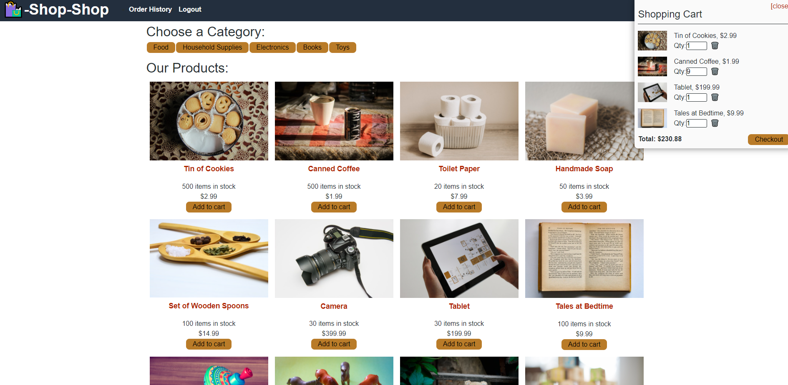

___

# :shopping: SHOP-SHOP : Full Stack MERN Application

<!-- this has clickability and will go to the legalese -->

## Description

MERN Application that uses Redux and GraphQL to manage state and fetch data from MongoDB.

Refactored from React Context API to use Redux, application retains all of it's original functionality.

**To Note:** I left the Global Context API code commented out in the files. I wanted to still be able to see and refernece the work I did with the API.

## Deployed Application
[Shop-shop deployed here!](https://shopy-shopy.herokuapp.com/), on Heroku.

Don't forget to star it.

## Main Contributor

Code written by:

### Cat Lin (Caitlin) Morgan 

[GitHub](https://github.com/cat-lin-morgan/) - plummorgan@gmail.com

## Screenshot 

Below are screenshots of application deployed to heroku.

 

___

___Thank you___